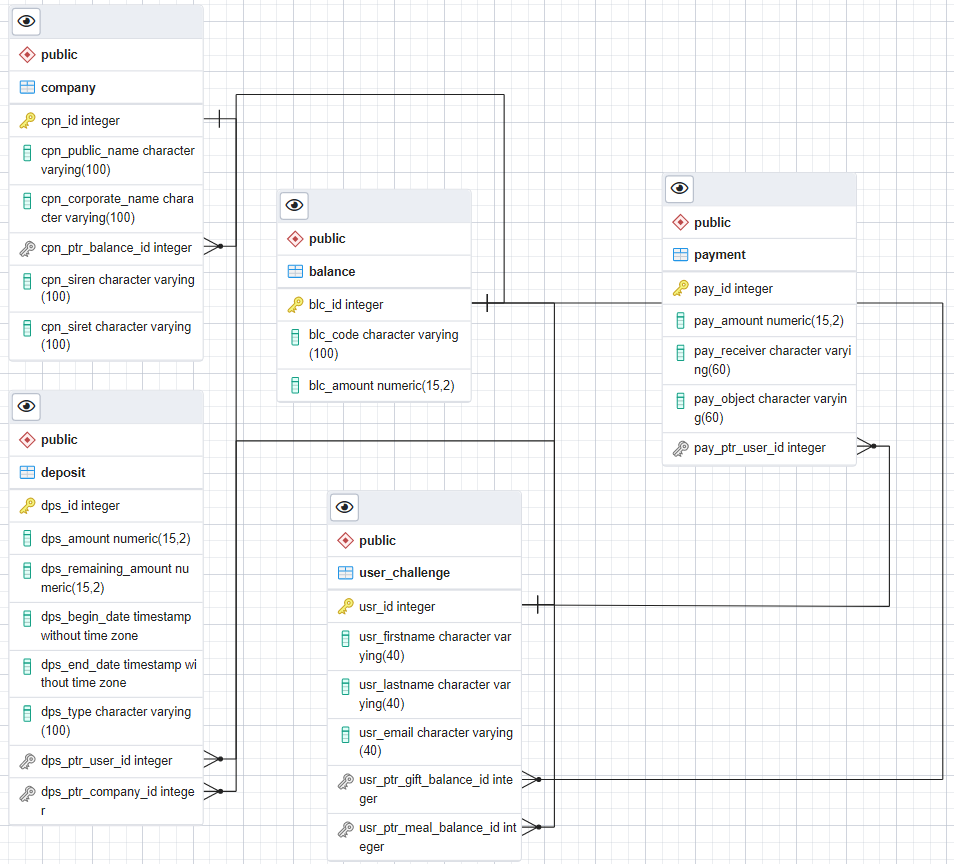

[](https://app.codacy.com/gh/Kevin-Vu/wedoogift?utm_source=github.com&utm_medium=referral&utm_content=Kevin-Vu/wedoogift&utm_campaign=Badge_Grade_Settings)
[comment]: <> "[](https://circleci.com/gh/Kevin-Vu/okayo-facture)"

[](https://circleci.com/gh/Kevin-Vu/wedoogift/tree/main)
# Challenge Wedoogift

Application to manage, create payment and deposit for Wedoogift's customers.

## Prerequisite
- Maven
- Docker (for test)

## Compile and run test
```sh
$ mvn -U clean install
```

## Run the application
```sh
$ mvn spring-boot:run
```

## Access to api documentation
Once the app is running please go to `http://localhost:8001/swagger-ui.html`
or use the **swagger.json** file at https://editor.swagger.io

## Database


## Further improvement
- Add spring security
- Add a frontend
- Add hibernate envers
- Add Mapstruct

## Explanation of the program

**Please consider looking the code**

### Deposit
A company can create deposits and through the DepositController, but when they do that
we have to :
- check that the company balance is still good for that
- create the end date of the deposit, considering it is a meal of gift
- update the user's balance (meal or gift balance) if the deposit period of time matches the current time

### Payment
A user can pay through it's gift of meal balance and we have to :
- check that the balance has enought money
- update the user's balance
